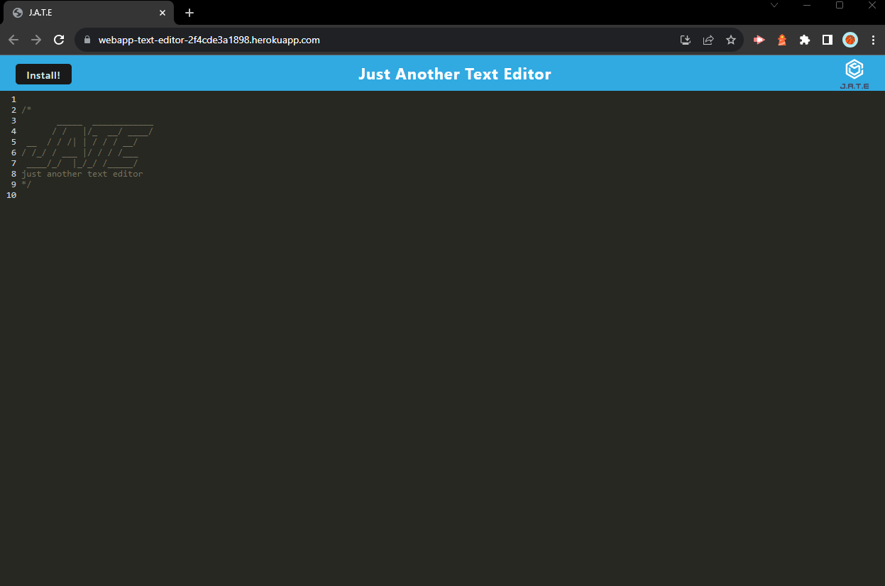

# Note-Taker-Express

Using express.js to create and have a productive note taker to save and retrieve user notes.

- View the GitHub [repository](https://github.com/Thomas-Barnhart/Web-App-Text-Editor)

## Table of Contents

- [About the Project](https://github.com/Thomas-Barnhart/Web-App-Text-Editor#about-the-project)
  - [Usage](https://github.com/Thomas-Barnhart/Web-App-Text-Editor#usage)

* [Start Your Own](https://github.com/Thomas-Barnhart/Web-App-Text-Editor#start-your-own)

- [Deployed Application](https://github.com/Thomas-Barnhart/Web-App-Text-Editor#Live-URL-of-Deployed-Application)

- [License](https://github.com/Thomas-Barnhart/Web-App-Text-Editor#license)
- [Roadmap](https://github.com/Thomas-Barnhart/Web-App-Text-Editor#roadmap)
- [Contribute](https://github.com/Thomas-Barnhart/Web-App-Text-Editor#contribute)
- [My Contact Information](https://github.com/Thomas-Barnhart/Web-App-Text-Editor#my-contact-information)

## About the Project

The Text Editor project represents a sophisticated web application designed to offer users a seamless and reliable experience for note-taking and code snippet creation, whether online or offline. Built as a single-page application with progressive web app (PWA) features, the project exhibits a robust structure and employs cutting-edge technologies. Leveraging the power of idb, a lightweight wrapper around the IndexedDB API, the text editor ensures persistent data storage, allowing users to access and retrieve their content with or without an internet connection.

Upon launching the application, users are greeted with a well-organized client-server folder structure. Running the application triggers backend startup and client serving, ensuring a smooth experience. The bundling of JavaScript files using webpack facilitates efficient execution, even with the incorporation of next-gen JavaScript features. The text editor seamlessly integrates with IndexedDB, creating a database storage immediately upon launch. Users can confidently input and save content, and thanks to IndexedDB, their data persists even when reopening the text editor. The project's PWA capabilities are demonstrated through the integration of Workbox for service worker registration, enabling offline functionality and efficient caching of static assets. Additionally, the user-friendly installation process further enhances accessibility, allowing users to download the web application as an icon on their desktop. Overall, this text editor project stands as a testament to the developer's mastery of web technologies, showcasing a feature-rich application with a focus on reliability and user experience.

### Usage

In this text editor project, I've created a feature-rich single-page application that serves as a progressive web app (PWA) with robust data persistence capabilities. Leveraging the idb package as a lightweight wrapper for IndexedDB API, the text editor functions seamlessly online and offline, allowing users to create and store notes or code snippets reliably. The application showcases a modern client-server folder structure, and upon running npm run start, the backend starts serving the client. The webpack plugins efficiently bundle JavaScript files, generating HTML, a service worker, and a manifest file. The use of next-gen JavaScript ensures smooth functionality without errors. IndexedDB immediately creates a database storage upon opening the text editor, saving and retrieving content effortlessly. The Install button facilitates downloading the web app as a desktop icon. Workbox registers a service worker for caching static assets, ensuring a responsive and efficient user experience. Deployment to Render is streamlined with proper build scripts for the webpack application. Overall, this project showcases a versatile and reliable text editor that meets PWA criteria, excels in data persistence, and functions seamlessly across various scenarios.

## Start Your Own

Copy this project on your local computer. Then run npm i.

## Live URL of Deployed Application

Deployed on Heroku:

https://webapp-text-editor-2f4cde3a1898.herokuapp.com/. 

### License

This is a brief and permissive license that necessitates only the retention of copyright and license notices. It allows the distribution of licensed works, modifications, and larger creations under varied terms, even without sharing the source code.

## Roadmap

Currently there are <u><b>NO</b></u> open issues. Please check the [issues](https://github.com/Thomas-Barnhart/Web-App-Text-Editor/issues) page on GitHub for any updates.

## Contribute

I welcome pull requests to enhance this project. If you intend to make significant alterations, please initiate an issue beforehand to deliberate on your proposed changes.

## My Contact Information

Email: tmbarnhart1@gmail.com

GitHub Page: [Thomas-Barnhart](https://github.com/Thomas-Barnhart)
